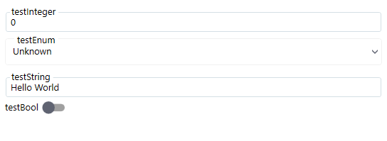

# Renderable Content Control #

RenderableContentControl is a WPF _UserControl_, which is able to automatically generate UI from C# objects acquired within Inxton Framework. Inxton compiler will create twin C# objects of PLC objects, which instances can be pass to RenderableContentControl to generate corresponding views. It's able to generate both complex objects (IVortexObject type) and primitive objects containing values (IValueTag type).

UI content is produced from the object bound to the 'DataContext' property of the _RCC_. The layout of the data can be organized with layout attributes of the members of the respective classes. Base types have their respective UI representation in 'Vortex.Presentation.Controls.Wpf' assembly that must be referenced in the WPF project.

## Principle of operation ##

The object bound to the 'DataContext' property of the _RCC_ is recursively searched for the eligible object to be visually represented. Each eligible object is then searched for layout attributes and **container** or **grouping** control is added to the 'VisualTree'. The type of representation is determined by the *PresentationType* property.

The diagram below represent fundamental logic of UI generation:


- When we use RenderableContentControl component it accepts context in form of IVortexObject/IValueTag instance and presentation type.
- RenderableContentControl will parse the input and set presentation type for objects.
- It will determine, whether input instance is of type IValueTag or IVortexObject:
    - IValueTag: The framework will find a corresponding UI primitive template and then render the UI.
    - IVortexObject: The framework will try to find a corresponding UI complex template. If the complex template is found, UI will be rendered. Otherwise, IVortexObject will be iterated down to primitive types, which then will be rendered with primitive UI templates.


## Basic example

Let's have following PLC structure `stExample`:

```
TYPE stExample :
STRUCT
	testInteger : INT;
	testEnum : stTestEnum;
	testString : STRING := 'Hello World';
	testBool : BOOL;
END_STRUCT
END_TYPE
```
We can create an instance of stExample struct and run Inxton build. After that, we can access instance of this struct and pass it as a parameter to the RenderableContentControl component like this:

```xml
<vortex:RenderableContentControl DataContext="{Binding Entry.MAIN.stExampleInstance}" PresentationType="Control"/>
```
We will get the following auto-generated UI:



## Standard presentation types ##

Presentation types serve for specifying mode in which UI will be rendered. Within Vortex.Presentation.Wpf framework following presentation types are supported.
- Display
- Control
- ShadowDisplay
- ShadowControl

In the Control presentation type, you can modify the values of objects. On the other hand, the Display presentation type serves for displaying values only -> they are read-only. If no presentation type is specified, Display presentation type will be used.


### Control ###

Will create controls that allow for modification of the **online** values.

In the Control presentation type, you can modify the values of objects.


### Display ###

Will create controls that display the **online** values but do not allow for their modification.

On the other hand, the Display presentation type serves for displaying values only -> they are read-only. If no presentation type is specified, Display presentation type will be used.

### ShadowControl ###

Will create controls that allow for modification of the **shadow** values.

### ShadowDisplay ###

Will create controls that display the **shadow** values but do not allow for their modification.

### Base ###

Will create controls with no presentation type signature.

### Manual ###

Typically used to display UI for manual control.


### Presentation Type pipe

The presentation type attribute can be pipe-lined using '-' to separate presentation types. When the control of given presentation type does not exist the next in the string is searched. So for example 'Manual-Base' will search for 'Manual' presentation controls if not found 'Base' presentation control will be used.

```xml
<vortex:RenderableContentControl DataContext="{Binding Entry.MAIN.stExampleInstance}" PresentationType="Manual-Control"/>
```

Let's add testVortexComponent: VortexComponent to the stExample structure. VortexComponent is a component from an external library whose UI implementation is of Manual presentation type.

```
TYPE stExample :
STRUCT
	testInteger : INT;
	testEnum : stTestEnum;
	testString : STRING := 'Hello World';
	testBool : BOOL;
	testVortexComponent: VortexComponent;  //added new property
END_STRUCT
END_TYPE
```

```xml
<vortex:RenderableContentControl DataContext="{Binding PLC.MAIN.stExampleInstance}" PresentationType="Manual-Control" />
```

You will get the following auto-generated UI:


You can see, primitive types are generated in Control presentation type whereas VortexComponent is generated in Manual presentation type.


## Layout attributes ##

Layout attributes allow for basic organization of the UI representation of a complex structure. The layout attributes can be placed to single members (variables) of basic or complex type, as well as to a type (STRUCT, FB etc.).

Placing attribute to a type definition:

~~~ S
{attribute wpf [Wpf.Container("TabControl")]}
TYPE stShape EXTENDS stRgbColor:
.
.
.
.
~~~

Placing attribute to member (variable) declaration:

~~~ S
{attribute wpf [Wpf.Container("Stack")]}
Width : REAL;
~~~

### Container layout attributes ###

| Type          | Description                                                                                                                                                                                 | Example                                      |
|---------------|:--------------------                                                                                                                                                                        |:-----                                        |
|"TabControl"   |Will add tab control to the presentation any following control will be placed into a separate tab item                                                                                       |{attribute wpf [Wpf.Container("TabControl")]}]||
|"Stack"        |Will add stack panel any following control will be stacked vertically.                                                                                                                       |{attribute wpf [Wpf.Container("Stack")]}]     ||
|"Wrap"         |Will ad wrap panel any following control will be wrapped horizontally (when the remaining width allows it, otherwise the controls not fitting horizontally will be wrapped vertically down). |{attribute wpf [Wpf.Container("Wrap")]}]      ||


### Layout attribute precedence ###

The **priority has the attribute defined in the declaration of a member**, when there is no layout attribute declared for the member the type definition's attribute used when declared.

## Usage ##

~~~ XML
...
xmlns:vortex="http://vortex.mts/xaml"
...

<vortex:RenderableContentControl DataContext="{Binding Plc.Examples, Mode=OneWay}" PresentationType="Control"/>
~~~

